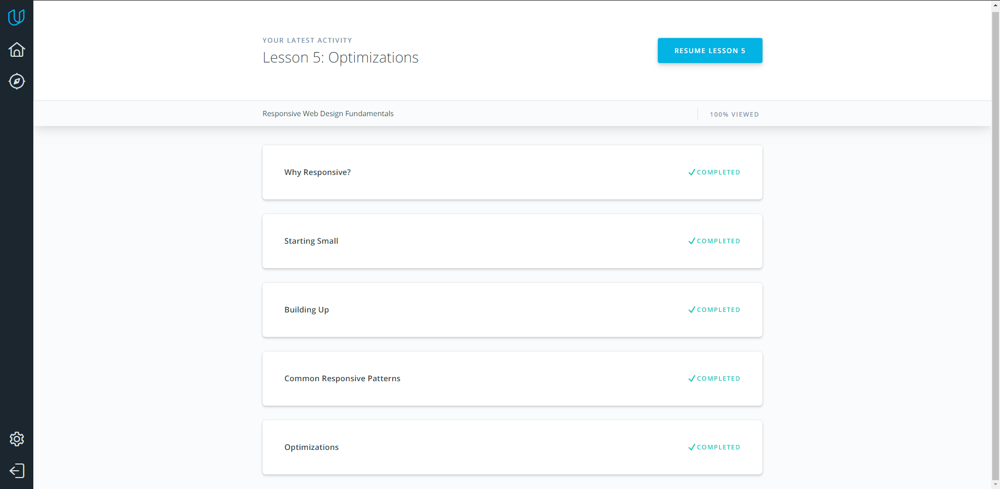
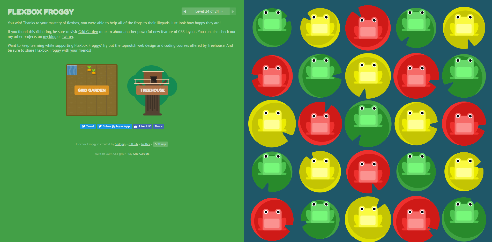

<!DOCTYPE html>

<head>
    <meta charset="utf-8" />
    <h1>Kottans Front-End Course</h1>
    <meta name="description" content="Stage 0. Self-Study" />
    <link rel="stylesheet" href="https://maxcdn.bootstrapcdn.com/bootstrap/3.3.7/css/bootstrap.min.css" integrity="sha384-BVYiiSIFeK1dGmJRAkycuHAHRg32OmUcww7on3RYdg4Va+PmSTsz/K68vbdEjh4u" crossorigin="anonymous">
    <link href="https://fonts.googleapis.com/icon?family=Material+Icons" rel="stylesheet">
</head>

<body>
    

        <h2>Responsive Web Design</h2>
    

    

    

    

    
<i>What was new to you?</i> - Info about grids.

    
<i>What surprised you?</i> - Flex Boxes if awesome.

    
<i>What you intend to use in future?</i> - I'll use flexbox to create fast and responsive layout for websites.

    

</body>
</html>
